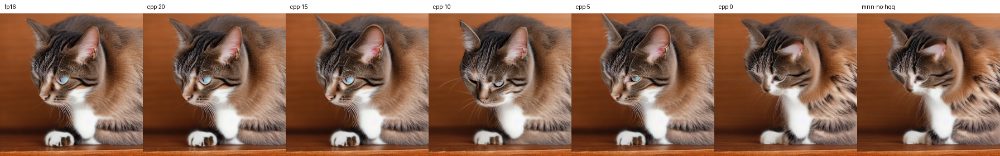
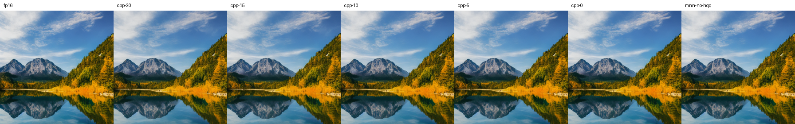
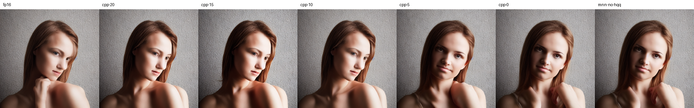

# SD1.5 Quantization
## Current Decision
- UNet: W8 + HQQ + Block128 (default 20 iterations)
- CLIP: FP16
- VAE: FP16
- Constants: keep original precision
- Mixed W4/W8: pending

> Windows OpenCL, high precision, buffer, tuning none, DDIM eta=0, 20 steps, seed 42, CFG 7.5, negative prompt 없음.

## Baseline
| UNet 모델 | 크기 | 최대 상대 L2 오차 | 이미지 PSNR |
| --- | --- | --- | --- |
| FP16 | 1.721GB | - | - |
| W8 | 0.864GB | 3.05% | 20.67dB |
| W8 + Block128 + HQQ | 0.885GB | 2.64% | 33.72dB |
| W8 + Block256 + HQQ | 0.872GB | 2.90% | 19.23dB |

## HQQ 보정 횟수 비교

* 입력: FP32 `v1-5-pruned-emaonly.safetensors`
* 템플릿: `sd15-hqq-b128-manual`. C++의 보정 횟수만 변경
* UNet: W8 + 비대칭 + Block128, 상수는 원래 정밀도 유지. CLIP/VAE: 동일 FP16
* 0회는 초기 min/max로 W8 양자화하고 HQQ 보정만 생략
* UNet 크기: 모든 보정 횟수에서 885,095,992 bytes

### 변환 시간

* 조건: Docker x86_64, Release, 64MiB memory/swap 제한, 입력 청크 1MiB, 빈 진행 콜백
* 측정 순서: 20 → 15 → 10 → 5 → 0, 각 1회

> 캐시 초기화 없이 측정. I/O 차이와 실행 간 변동 포함

| 보정 횟수 | 전체 변환(s) | HQQ 계산 배치(s) | 20회 대비 시간 감소 | Peak RSS(KiB) |
| --- | --- | --- | --- | --- |
| 20 | 191.49 | 158.30 | - | 12,384 |
| 15 | 153.18 | 120.24 | 20.0% | 12,540 |
| 10 | 113.70 | 83.33 | 40.6% | 12,536 |
| 5 | 70.08 | 44.91 | 63.4% | 12,348 |
| 0 | 22.57 | 2.67 | 88.2% | 12,344 |

* HQQ 계산 배치: 초기화·보정·payload/alpha 생성·진행 확인 포함. 입력 변환·파일 I/O 제외
* 20회 기준 HQQ 계산 배치는 전체 변환 시간의 82.7%

### 이미지 비교

* 기존 Windows OpenCL runner 사용. FP16 기준 이미지도 동일 조건으로 새로 생성
* 실행: high precision, buffer, tuning none
* 추론: DDIM eta=0, 20 steps, CFG 7.5, negative prompt 없음, 512×512

| 조건 | Seed | Prompt |
| --- | --- | --- |
| 고양이 | 42 | a photo of a cat sitting on a wooden table, natural light |
| 산·호수 | 123 | a beautiful mountain landscape with a clear lake, blue sky, detailed photography |
| 인물 | 2026 | a portrait photo of a young woman, natural light, detailed face, professional photography |

> 산·호수와 인물은 과거 프롬프트 기록이 없어 위 문구로 새로 비교. 과거 표와 직접 비교하지 않음

FP16 이미지 기준 PSNR(dB):

| 보정 횟수 | 고양이 | 산·호수 | 인물 |
| --- | --- | --- | --- |
| 20 | 34.11 | 31.35 | 24.46 |
| 15 | 27.95 | 32.42 | 22.14 |
| 10 | 21.10 | 34.45 | 25.19 |
| 5 | 25.73 | 34.67 | 20.87 |
| 0 | 19.35 | 36.51 | 20.60 |
| MNNConvert, HQQ 미적용 | 19.30 | 36.58 | 20.54 |

HQQ 20회 이미지 기준 PSNR(dB) / SSIM:

| 보정 횟수 | 고양이 | 산·호수 | 인물 |
| --- | --- | --- | --- |
| 15 | 29.64 / 0.9287 | 42.55 / 0.9937 | 28.84 / 0.9241 |
| 10 | 20.99 / 0.7718 | 35.50 / 0.9779 | 33.48 / 0.9736 |
| 5 | 25.71 / 0.8653 | 35.86 / 0.9790 | 21.56 / 0.7951 |
| 0 | 19.34 / 0.6844 | 32.56 / 0.9599 | 21.10 / 0.8001 |

* PSNR: 최종 RGB8 PNG 픽셀 기준. 동일 이미지의 무한대 값은 JSON에 `null`로 기록
* SSIM: RGB 채널 평균, 11×11 Gaussian(sigma=1.5), valid 영역, 모집단 공분산 기준

### C++ 0회와 MNNConvert HQQ 미적용 비교

* 입력: 동일 원본에서 만든 FP32 ONNX
* UNet: 아래 옵션으로 변환. `--fp16`·`--hqq` 미사용
* CLIP/VAE: 동일 FP16 파일 복사

```bash
mnnconvert -f ONNX --modelFile /artifacts/onnx/unet/model.onnx \
  --MNNModel /artifacts/hqq-iterations-20261010/mnn-no-hqq/unet.mnn \
  --transformerFuse --optimizePrefer 2 --optimizeLevel 1 \
  --weightQuantBits 8 --weightQuantAsymmetric=1 --weightQuantBlock 128
```

| C++ 0회 ↔ MNNConvert 미적용 | PSNR(dB) | SSIM | 픽셀 완전 일치 |
| --- | --- | --- | --- |
| 고양이 | 35.56 | 0.9811 | 아니오 |
| 산·호수 | 56.54 | 0.9993 | 아니오 |
| 인물 | 42.90 | 0.9936 | 아니오 |

> 세 이미지가 유사하지만 픽셀은 불일치. 두 변환 경로의 바이트 일치를 보장하지 않음

### 최종 이미지 비교

* 왼쪽부터 FP16 → C++ HQQ 20회 → 15회 → 10회 → 5회 → 0회 → MNNConvert HQQ 미적용

고양이 / seed 42:

[](img/sd15/hqq-iterations-cat.webp)

산·호수 / seed 123:

[](img/sd15/hqq-iterations-landscape.webp)

인물 / seed 2026:

[](img/sd15/hqq-iterations-portrait.webp)

## Constant Precision
| Prompt / seed | FP32 상수 PSNR | FP16 상수 PSNR |
| --- | --- | --- |
| 고양이 / 42 | 28.78dB | 28.97dB |
| 산·호수 / 123 | 27.50dB | 27.10dB |
| 인물 / 2026 | 43.10dB | 42.21dB |

## Block Sweep
| Block | UNet 크기(MB, 10^6 bytes) | 최대 상대 L2 | 고양이 PSNR | 산·호수 PSNR | 인물 PSNR |
| --- | --- | --- | --- | --- | --- |
| 128 | 885.096 | 2.8258% | 28.78dB | 27.50dB | 43.10dB |
| 64 | 909.201 | 2.1518% | 26.75dB | 26.04dB | 39.92dB |
| 32 | 956.474 | 1.9379% | 18.64dB | 30.23dB | 45.77dB |

## Findings
- B128 is current baseline.
- Smaller block lowers tensor L2 but does not consistently improve final-image PSNR.
- FP16 conversion of small constants has negligible size benefit.
- Final image metrics must accompany tensor-level error.

## Next
- Mixed W4/W8 + HQQ
- Android benchmark

## C++ Template Conversion
- Reference: `quant-revalidation/w8-block128-hqq`, original FP32 constants
- Python template: 1,013,808 bytes; manifest v2: 1,340,746 bytes
- C++ regenerates W8 payload and FP32 min/scale from safetensors without MNNConvert or MNN Runtime
- Independent comparison: CLIP 209/209, UNet 1117/1117, VAE 154/154 storage tensors byte-identical; all graph bytes identical
- UNet includes 282 W8 payloads and 282 min/scale tensors; other tensors retain their reference dtype
- Docker x86_64, 64MiB memory/swap limit, 1MiB input chunk: 185.42s wall time, 13,800KiB peak RSS
- Scope: this checkpoint and PC environment; Android numerical reproducibility is unverified
- Commands: [README](../README.md#2-sd15-fp32--c-w8-양자화)

### HQQ 그룹 병렬화 측정

- API `thread_count=1..8`, 기본 1. 호출 스레드 포함이며 추가 스레드는 변환 동안 재사용
- Intel Core i5-13600KF, Docker Desktop Linux x86_64, 논리 CPU 20개, GCC 12.2 Release
- 동일 SD1.5 체크포인트·B128 템플릿, HQQ 20회, 입력 청크 1MiB, 컨테이너 64MiB·swap 없음
- 각 설정 2회. 순서 `1,2,4,8,8,4,2,1`. CPU 고정·cold cache 초기화 없이 실행한 탐색 측정
- 기준 모델의 1,480개 tensor 이름·shape·dtype·저장 바이트와 그래프 일치. 반복 실행 8개 출력은 모든 파일의 SHA-256 일치
- RSS는 `/usr/bin/time -v`의 프로세스 최대 상주 메모리. 예약된 가상 스택 전체 크기가 아니며 컨테이너 전체 메모리와도 다름
- CTest 5개, ASan/UBSan, HQQ 작업 스레드 TSan 검사 통과.

| 계산 스레드 | 전체 평균 / 범위(초) | HQQ 평균(초) | 전체 가속비 | 최대 RSS(KiB) |
| --- | --- | --- | --- | --- |
| 1 | 176.53 / 176.34–176.72 | 158.87 | 1.00× | 10,548 |
| 2 | 98.56 / 97.51–99.61 | 81.06 | 1.79× | 10,828 |
| 4 | 57.36 / 56.56–58.16 | 41.14 | 3.08× | 10,708 |
| 8 | 46.73 / 46.53–46.93 | 30.21 | 3.78× | 10,712 |


측정 명령(각 실행마다 새 출력 경로 사용):

```bash
docker build -f docker/sd15/converter.Dockerfile -t to-mnn-sd15:parallel .
docker run --rm --network none --memory 64m --memory-swap 64m \
  -v "$PWD/models:/models:ro" -v "$PWD/artifacts:/artifacts" \
  --entrypoint /usr/bin/time to-mnn-sd15:parallel -v \
  sd15-convert --checkpoint /models/v1-5-pruned-emaonly.safetensors \
  --template-dir /artifacts/templates/sd15-hqq-b128-manual \
  --output /artifacts/hqq-threads-4 --threads 4
```
